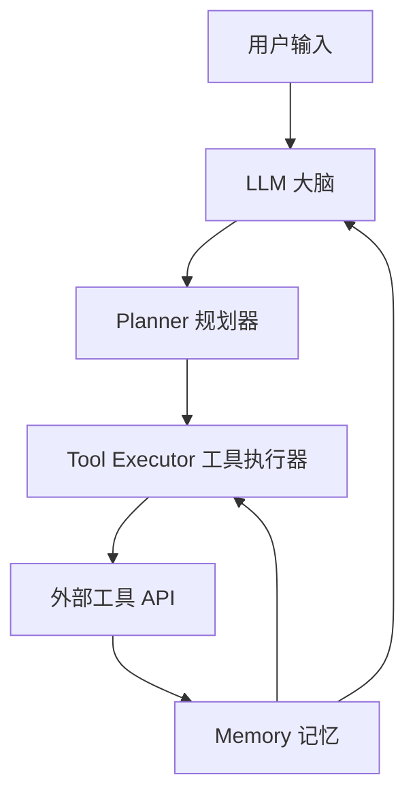

# 第1章 认识AI Agent

> **学习目标**  
> - 记忆：AI Agent核心特征与组件定义  
> - 理解：Agent与传统AI系统的本质区别  

---

## 什么是AI Agent？

AI Agent（人工智能代理）是一种能够**自主执行任务、做出决策、与环境交互**的人工智能系统。它不仅能够理解用户的指令，还能主动规划执行步骤，调用必要的工具，最终完成任务。

### 核心特征

| 特征 | 说明 | 与传统AI对比 |
|------|------|-------------|
| **自主性** | 能够独立做出决策和执行任务 | 传统AI需显式编程决策逻辑 |
| **感知能力** | 能够感知和理解环境信息 | 传统AI仅处理预定义输入格式 |
| **规划能力** | 能够制定执行计划 | 传统AI无规划，仅执行固定流程 |
| **学习能力** | 能够从经验中学习和改进 | 传统AI学习能力有限（需重新训练） |
| **交互能力** | 能够与用户和其他系统交互 | 传统AI交互方式单一（API/命令） |

---

## Agent的核心组件

### 大脑（LLM）

- **作用**：理解意图、逻辑判断、生成文本  
- **技术实现**：GPT-4、Claude、DeepSeek、通义千问  
- **类比**：餐厅的主厨（知道做什么、怎么做）

### 规划器（Planner）

- **作用**：把大目标拆解成小步骤  
- **技术实现**：提示词链、决策树、图规划  
- **类比**：菜谱（步骤顺序）

### 工具执行器（Tool Executor）

- **作用**：调用外部能力（搜索、计算、API）  
- **技术实现**：REST客户端、数据库驱动、API SDK  
- **类比**：厨具（锅碗瓢盆）

### 记忆系统（Memory）

- **作用**：保存对话历史和用户偏好  
- **技术实现**：短期记忆（LinkedList）、长期记忆（RAG）  
- **类比**：笔记本（记录关键信息）

---

## Agent vs 传统AI

| 维度 | 传统AI | AI Agent |
|------|--------|---------|
| **决策方式** | 预定义规则/模型输出 | LLM自主推理+规划 |
| **任务范围** | 单一任务（如分类、翻译） | 多任务协作（如订机票+酒店+行程） |
| **扩展性** | 需重新训练/编码 | 新增工具即可扩展能力 |
| **上下文理解** | 有限（固定窗口） | 会话历史+长期记忆 |

---

## Agent的典型应用场景

| 场景 | 说明 | 案例 |
|------|------|------|
| **个人助理** | 日程管理、信息查询 | Siri、Alexa、通义千问 |
| **工作助手** | 文档处理、数据分析 | Copilot、Kimi |
| **专业领域** | 医疗诊断、金融分析 | IBM Watson、金融大模型 |
| **教育辅导** | 个性化学习、智能答疑 | 学而思AI老师、科大讯飞星火 |

---

## 实战：绘制Agent组件关系图

### 任务

请用Mermaid语法绘制Agent组件协作图：

### 课后练习

**绘制以下任务的Agent组件图**：  
任务："帮我整理上周的邮件，找出需要回复的，并按优先级排序"

| 组件 | 在这个任务中的作用 |
|------|-------------------|
| 大脑（LLM） | _________________________________ |
| 规划器（Planner） | _________________________________ |
| 工具执行器（Tool Executor） | _________________________________ |
| 记忆（Memory） | _________________________________ |

---

## 本章小结

| 要点 | 内容 |
|------|------|
| **Agent定义** | 自主执行任务的人工智能系统 |
| **四大组件** | 大脑、规划器、工具执行器、记忆 |
| **核心优势** | 自主性、规划能力、扩展性、上下文理解 |
| **Java衔接** | 本章为概念阶段，后续章节引入Java实现 |

---

## 参考资源

- **AgentScope-Java源码**：`E:\github\agentscope-java-textbook\src\chapter4\AgentStructure.java`
- **Agent组件详解**：`docs/Appendix_Components.md`
- **Agent类型与应用场景**：`docs/Appendix_Types.md`

---

## 本章考核

### 选择题

1. Agent的四大核心组件中，哪一个是"厨具"？  
   A. 大脑（LLM）  
   B. 规划器（Planner）  
   C. 工具执行器（Tool Executor）  
   D. 记忆（Memory）  
   **答案：C**

2. 与传统AI相比，Agent最显著的优势是？  
   A. 计算速度更快  
   B. 能够自主规划和扩展工具  
   C. 训练数据量更大  
   D. 模型参数更多  
   **答案：B**

### 简答题

1. 用一句话解释Agent的核心工作原理。  
   **参考答案**：LLM理解意图→规划器拆解步骤→工具执行器调用外部能力→记忆保存历史。

2. 为什么说Agent是"自主"而非"自动"？  
   **参考答案**：自动是预设流程执行（如机器人流水线），自主是LLM动态推理+规划（如人类决策）。

---

> 版本：v0.1.0-alpha  
> 更新日期：2026-04-17
