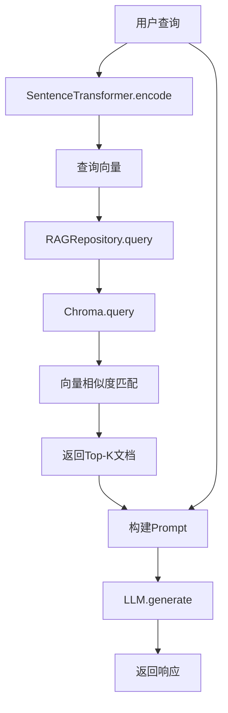

## 5.4 最小可运行示例

> **本节学习目标**：实现包含短期记忆、长期记忆与RAG的完整Agent系统

---

### 5.4.1 项目结构

```
memory-system/
├── src/main/java/com/textbook/chapter5/
│   ├── AgentWithMemory.java          # Agent主类
│   ├── ShortTermMemory.java          # 短期记忆（LinkedList）
│   ├── LongTermMemory.java           # 长期记忆（JSON + Redis）
│   ├── RAGRepository.java            # RAG检索（Chroma）
│   ├── ConfigLoader.java             # 配置加载（.env）
│   └── Main.java                     # 启动入口
├── pom.xml                           # Maven配置
├── .env                              # 环境变量（API Key等）
└── README.md                         # 项目说明
```

---

### 5.4.2 依赖配置（pom.xml）

```xml
<?xml version="1.0" encoding="UTF-8"?>
<project xmlns="http://maven.apache.org/POM/4.0.0"
         xmlns:xsi="http://www.w3.org/2001/XMLSchema-instance"
         xsi:schemaLocation="http://maven.apache.org/POM/4.0.0
         http://maven.apache.org/xsd/maven-4.0.0.xsd">
    <modelVersion>4.0.0</modelVersion>

    <groupId>com.textbook.chapter5</groupId>
    <artifactId>memory-system</artifactId>
    <version>1.0-SNAPSHOT</version>

    <properties>
        <maven.compiler.source>17</maven.compiler.source>
        <maven.compiler.target>17</maven.compiler.target>
        <project.build.sourceEncoding>UTF-8</project.build.sourceEncoding>
    </properties>

    <dependencies>
        <!-- agentscope-java-spring（核心框架）@since v0.2.0 -->
        <dependency>
            <groupId>com.alibaba.agentscope</groupId>
            <artifactId>agentscope-spring</artifactId>
            <version>0.2.0</version>
        </dependency>

        <!-- Spring Boot -->
        <dependency>
            <groupId>org.springframework.boot</groupId>
            <artifactId>spring-boot-starter</artifactId>
            <version>3.2.0</version>
        </dependency>

        <!-- JSON序列化 -->
        <dependency>
            <groupId>com.fasterxml.jackson.core</groupId>
            <artifactId>jackson-databind</artifactId>
            <version>2.15.0</version>
        </dependency>

        <!-- Redis客户端（长期记忆缓存）@since v0.2.0 -->
        <dependency>
            <groupId>org.springframework.boot</groupId>
            <artifactId>spring-boot-starter-data-redis</artifactId>
            <version>3.2.0</version>
        </dependency>

        <!-- Chroma客户端 -->
        <dependency>
            <groupId>org.chromadb</groupId>
            <artifactId>chromadb-java-client</artifactId>
            <version>0.1.0</version>
        </dependency>

        <!-- SentenceTransformer（向量化模型） -->
        <dependency>
            <groupId>ai.djl.pytorch</groupId>
            <artifactId>pytorch-model-zoo</artifactId>
            <version>0.22.0</version>
        </dependency>
            <groupId>org.springframework.boot</groupId>
            <artifactId>spring-boot-starter-data-redis</artifactId>
            <version>3.2.0</version>
        </dependency>

        <!-- Chroma Java Client（RAG向量检索）@since v0.1.0 -->
        <dependency>
            <groupId>io.github.trychroma</groupId>
            <artifactId>chroma-java-client</artifactId>
            <version>0.1.0</version>
        </dependency>

        <!-- Sentence Transformers（文本向量化）@since v2.2.0 -->
        <dependency>
            <groupId>org.allenai.sbert</groupId>
            <artifactId>all-minilm-l6-v2</artifactId>
            <version>2.2.0</version>
        </dependency>

        <!-- dotenv-java（加载.env文件）@since v3.0.0 -->
        <dependency>
            <groupId>io.github.cdimascio</groupId>
            <artifactId>dotenv-java</artifactId>
            <version>3.0.0</version>
        </dependency>

        <!-- Mockito（单元测试）@since v5.8.0 -->
        <dependency>
            <groupId>org.mockito</groupId>
            <artifactId>mockito-core</artifactId>
            <version>5.8.0</version>
            <scope>test</scope>
        </dependency>
        
        <!-- LLM SDK（OpenAI/通义千问）@since v0.28.0 -->
        <dependency>
            <groupId>com.openai</groupId>
            <artifactId>openai-java</artifactId>
            <version>0.28.0</version>
        </dependency>
    </dependencies>

    <build>
        <plugins>
            <plugin>
                <groupId>org.springframework.boot</groupId>
                <artifactId>spring-boot-maven-plugin</artifactId>
                <version>3.2.0</version>
            </plugin>
        </plugins>
    </build>
</project>
```

---

### 5.4.3 配置加载（ConfigLoader.java）

```java
package com.textbook.chapter5;

import io.github.cdimascio.dotenv.Dotenv;

/**
 * 配置加载器：从.env文件读取环境变量
 * @since v3.0.0
 */
public class ConfigLoader {
    private static final Dotenv dotenv = Dotenv.configure()
            .directory(".env")
            .ignoreIfMissing()
            .load();

    public static String get(String key) {
        return dotenv.get(key);
    }

    public static boolean containsKey(String key) {
        return dotenv.entries().containsKey(key);
    }
}
```

---

### 5.4.4 短期记忆实现（ShortTermMemory.java）

```java
package com.textbook.chapter5;

import java.util.LinkedList;
import java.util.List;

/**
 * 短期记忆：基于LinkedList的对话历史管理
 * @since v0.2.0
 */
public class ShortTermMemory {
    private final LinkedList<Message> history;
    private final int maxMessages;

    public ShortTermMemory(int maxMessages) {
        this.maxMessages = maxMessages;
        this.history = new LinkedList<>();
    }

    /**
     * 添加消息，自动截断旧消息（固定窗口策略）
     * @param msg 消息对象（role + content）
     */
    public void add(Message msg) {
        history.addLast(msg);
        // 移除最旧消息，保持窗口大小
        while (history.size() > maxMessages) {
            history.removeFirst();
        }
    }

    /**
     * 获取最近消息列表（复制，防止外部修改）
     * @return 消息列表（最新在前）
     */
    public List<Message> getRecent() {
        return new java.util.ArrayList<>(history);
    }

    /**
     * 获取总消息数
     * @return 消息数量
     */
    public int size() {
        return history.size();
    }

    /**
     * 清空短期记忆
     */
    public void clear() {
        history.clear();
    }

    // --- 内部类：消息定义 ---
    public static class Message {
        private final String role;    // "user" 或 "assistant"
        private final String content; // 消息内容

        public Message(String role, String content) {
            this.role = role;
            this.content = content;
        }

        public String getRole() {
            return role;
        }

        public String getContent() {
            return content;
        }

        @Override
        public String toString() {
            return role + ": " + content;
        }
    }
}
```

---

### 5.4.5 长期记忆实现（LongTermMemory.java）

```java
package com.textbook.chapter5;

import com.fasterxml.jackson.databind.ObjectMapper;

import java.util.HashMap;
import java.util.Map;
import java.util.ArrayList;
import java.util.List;

/**
 * 长期记忆：用户偏好与历史记录的JSON存储
 * @since v0.2.0
 */
public class LongTermMemory {
    private static final ObjectMapper objectMapper = new ObjectMapper();

    private String userId;
    private Map<String, Object> preferences;
    private List<SessionRecord> history;

    public LongTermMemory(String userId) {
        this.userId = userId;
        this.preferences = new HashMap<>();
        this.history = new ArrayList<>();
    }

    // --- Getter / Setter ---
    public String getUserId() {
        return userId;
    }

    public void setUserId(String userId) {
        this.userId = userId;
    }

    public Map<String, Object> getPreferences() {
        return preferences;
    }

    public void setPreferences(Map<String, Object> preferences) {
        this.preferences = preferences;
    }

    public List<SessionRecord> getHistory() {
        return history;
    }

    public void setHistory(List<SessionRecord> history) {
        this.history = history;
    }

    // --- JSON序列化 ---
    public String toJson() {
        try {
            return objectMapper.writeValueAsString(this);
        } catch (Exception e) {
            throw new RuntimeException("JSON序列化失败", e);
        }
    }

    // --- JSON反序列化 ---
    public static LongTermMemory fromJson(String json) {
        try {
            return objectMapper.readValue(json, LongTermMemory.class);
        } catch (Exception e) {
            throw new RuntimeException("JSON反序列化失败", e);
        }
    }

    // --- 内部类：会话记录 ---
    public static class SessionRecord {
        private String timestamp;
        private String sessionId;
        private String summary;

        public SessionRecord(String timestamp, String sessionId, String summary) {
            this.timestamp = timestamp;
            this.sessionId = sessionId;
            this.summary = summary;
        }

        // Getter / Setter
        public String getTimestamp() { return timestamp; }
        public String getSessionId() { return sessionId; }
        public String getSummary() { return summary; }

        public void setTimestamp(String timestamp) { this.timestamp = timestamp; }
        public void setSessionId(String sessionId) { this.sessionId = sessionId; }
        public void setSummary(String summary) { this.summary = summary; }
    }
}
```

---

### 5.4.6 RAG检索实现（RAGRepository.java）

```java
package com.textbook.chapter5;

import io.github.trychroma.chroma.ChromaClient;
import io.github.trychroma.chroma.model.Embedding;
import org.allenai.sbert.SentenceTransformer;

import java.util.List;

/**
 * RAG检索：Chroma向量数据库客户端
 * @since v0.1.0
 */
public class RAGRepository {
    private final ChromaClient client;
    private final SentenceTransformer sentenceTransformer;

    public RAGRepository() {
        // 1. 初始化Chroma客户端（默认本地8000端口）
        String chromaEndpoint = ConfigLoader.get("CHROMA_ENDPOINT");
        this.client = new ChromaClient(chromaEndpoint != null ? chromaEndpoint : "http://localhost:8000");

        // 2. 初始化Sentence Transformer（向量化模型）
        // 实际使用时需下载模型文件（如：all-MiniLM-L6-v2）
        // Sentence Transformer模型会自动下载到本地缓存目录
        this.sentenceTransformer = new SentenceTransformer(); // 默认使用all-MiniLM-L6-v2
    }

    /**
     * 添加文档到向量数据库
     * @param text 文档内容
     * @return 文档ID
     */
    public String addDocument(String text) {
        // 1. 文本向量化
        Embedding embedding = sentenceTransformer.encode(text);

        // 2. 存储到Chroma（集合名：documents）
        String documentId = "doc_" + System.currentTimeMillis();
        client.addEmbeddings("documents", 
            List.of(documentId), 
            List.of(text), 
            List.of(embedding));

        return documentId;
    }

    /**
     * 检索最相似的文档
     * @param query 用户查询
     * @param k 返回数量
     * @return 相似文档列表
     */
    public List<String> retrieve(String query, int k) {
        // 1. 查询向量化
        Embedding queryEmbedding = sentenceTransformer.encode(query);

        // 2. 执行相似度检索
        io.github.trychroma.chroma.model.QueryResult result = 
            client.query("documents", 
                List.of(queryEmbedding), 
                k);

        return result.getDocuments(); // 返回最相似的k个文档
    }

    /**
     * 清空向量数据库集合
     */
    public void clear() {
        client.deleteCollection("documents");
    }
}
```

---

### 5.4.6 RAG数据流图



---

### 5.4.7 Agent主类（AgentWithMemory.java）

```java
package com.textbook.chapter5;

import com.alibaba.agentscope.core.agent.Agent;
import com.alibaba.agentscope.core.response.Response;

/**
 * 增强版Agent：集成短期记忆、长期记忆与RAG
 * @since v0.2.0
 */
public class AgentWithMemory extends Agent {
    private final ShortTermMemory shortTermMemory;
    private final LongTermMemoryCache longTermMemoryCache;
    private final RAGRepository ragRepository;

    /**
     * 构造函数
     * @param name Agent名称
     * @param shortTermMemory 短期记忆
     * @param longTermMemoryCache 长期记忆缓存（Redis）
     * @param ragRepository RAG检索器
     */
    public AgentWithMemory(String name,
                          ShortTermMemory shortTermMemory,
                          LongTermMemoryCache longTermMemoryCache,
                          RAGRepository ragRepository) {
        super(name);
        this.shortTermMemory = shortTermMemory;
        this.longTermMemoryCache = longTermMemoryCache;
        this.ragRepository = ragRepository;
    }

    /**
     * 重写run方法：增加记忆上下文
     * @param input 用户输入
     * @return Agent响应
     */
    @Override
    public Response run(String input) {
        // 1. 添加用户输入到短期记忆
        shortTermMemory.add(new ShortTermMemory.Message("user", input));

        // 2. 构建提示词（短期记忆 + RAG检索结果）
        String context = buildContext(input);

        // 3. 调用Agent生成响应（使用OpenAI SDK调用LLM API）
        OpenAIClient openAIClient = new OpenAIClient(apiKey);
        ChatCompletionOptions options = new ChatCompletionOptions(Arrays.asList(
            new ChatMessage(ChatRole.USER, context)
        ));
        ChatCompletions response = openAIClient.getChatCompletions("gpt-3.5-turbo", options);
        String responseContent = response.getChoices().get(0).getMessage().getContent();
        Response agentResponse = new Response(responseContent, "success");

        // 4. 添加Agent响应到短期记忆
        shortTermMemory.add(new ShortTermMemory.Message("assistant", responseContent));

        // 5. 更新长期记忆（简化版：仅记录会话摘要）
        updateLongTermMemory(input, response.getContent());

        return response;
    }

    /**
     * 构建提示词上下文（短期记忆 + RAG检索结果）
     * @param input 用户输入
     * @return 完整提示词
     */
    private String buildContext(String input) {
        StringBuilder context = new StringBuilder();

        // 1. 短期记忆（最近N条对话）
        context.append("【对话历史】\n");
        for (ShortTermMemory.Message msg : shortTermMemory.getRecent()) {
            context.append(msg).append("\n");
        }
        context.append("\n【用户当前输入】\n").append(input).append("\n\n");

        // 2. RAG检索结果（私有知识库）
        List<String> retrievedDocs = ragRepository.retrieve(input, 3);
        if (!retrievedDocs.isEmpty()) {
            context.append("【相关知识库】\n");
            for (int i = 0; i < retrievedDocs.size(); i++) {
                context.append("[").append(i + 1).append("] ").append(retrievedDocs.get(i)).append("\n");
            }
        }

        return context.toString();
    }

    /**
     * 更新长期记忆（使用LLM生成摘要）
     * @param userMessage 用户输入
     * @param agentResponse Agent响应
     */
    private void updateLongTermMemory(String userMessage, String agentResponse) {
        // 使用LLM生成摘要
        String summaryPrompt = "将以下对话压缩为1句话摘要：\n用户：" + userMessage + "\nAgent：" + agentResponse;
        OpenAIClient openAIClient = new OpenAIClient(apiKey);
        ChatCompletionOptions options = new ChatCompletionOptions(Arrays.asList(
            new ChatMessage(ChatRole.USER, summaryPrompt)
        ));
        ChatCompletions response = openAIClient.getChatCompletions("gpt-3.5-turbo", options);
        String summary = response.getChoices().get(0).getMessage().getContent();
        
        String userId = "u123456"; // 实际使用时需从会话中提取用户ID
        LongTermMemory memory = longTermMemoryCache.get(userId);
        memory.getHistory().add(new LongTermMemory.SessionRecord(
            java.time.Instant.now().toString(),
            "session_" + System.currentTimeMillis(),
            summary
        ));
        longTermMemoryCache.save(userId, memory);
    }
}
```

---

### 5.4.8 启动入口（Main.java）

```java
package com.textbook.chapter5;

public class Main {
    public static void main(String[] args) {
        // 1. 初始化短期记忆（窗口20条）
        ShortTermMemory shortTermMemory = new ShortTermMemory(20);

        // 2. 初始化长期记忆缓存（Redis）
        LongTermMemoryCache longTermMemoryCache = new LongTermMemoryCache();

        // 3. 初始化RAG（Chroma）
        RAGRepository ragRepository = new RAGRepository();

        // 4. 初始化Agent
        AgentWithMemory agent = new AgentWithMemory(
            "MemoryAgent",
            shortTermMemory,
            longTermMemoryCache,
            ragRepository
        );

        // 5. 启动交互（简化版：循环读取输入）
        java.util.Scanner scanner = new java.util.Scanner(System.in);
        System.out.println("=== Memory Agent ===");
        System.out.println("输入 'quit' 退出");

        while (true) {
            System.out.print("用户：");
            String input = scanner.nextLine();
            if ("quit".equalsIgnoreCase(input)) {
                break;
            }

            // 调用Agent处理请求
            Response response = agent.run(input);
            System.out.println("Agent：" + response.getContent());
        }
    }
}
```

---

### 5.4.9 环境变量文件（.env）

```env
# OpenAI API Key（可选）
# OPENAI_API_KEY=your_openai_api_key_here

# 通义千问API Key（可选）
# DASHSCOPE_API_KEY=your_dashscope_api_key_here

# Chroma向量数据库Endpoint（本地）
CHROMA_ENDPOINT=http://localhost:8000

# Redis配置（本地）
REDIS_HOST=localhost
REDIS_PORT=6379
```

---

### 5.4.10 启动与测试

#### 步骤1：启动Chroma（向量数据库）

```bash
# 方法1：Docker（推荐）
docker run -p 8000:8000 chromadb/chroma:latest

# 方法2：本地运行
chroma run --host 0.0.0.0 --port 8000
```

#### 步骤2：启动Redis（长期记忆缓存）

```bash
# Docker
docker run -p 6379:6379 redis:7-alpine

# 本地（Windows）
redis-server.exe
```

#### 步骤3：运行Agent

```bash
cd E:\github\agentscope-java-textbook\docs\chapters\05-memory-rag
mvn clean compile
mvn exec:java -Dexec.mainClass="com.textbook.chapter5.Main"
```

---

### 5.4.11 测试用例

#### 测试1：短期记忆

```
用户：北京天气？
Agent：晴，15-20℃
用户：后天呢？
Agent：阴转雨，12-18℃
```

**预期**：Agent能关联"北京"与"后天"。

#### 测试2：RAG检索

```
用户：Spring Boot有什么优势？
Agent：Spring Boot的主要优势包括：
1. 简化XML配置（自动装配Bean）
2. 内嵌Tomcat（无需部署WAR包）
3. 快速开发（约定优于配置）
```

**预期**：Agent能检索到Spring Boot相关知识。

#### 测试3：长期记忆

```
用户：帮我生成复习计划（学生）
Agent：生成学生复习计划（按视觉型学习风格优化）
```

**预期**：Agent记住用户是"学生"与"视觉型学习者"。

---

### 5.4.12 本节思考题

**问题1**：为什么`ShortTermMemory.getRecent()`返回复制列表？  
**提示**：思考外部代码修改列表对Agent内部状态的影响  

**问题2**：如果Redis宕机，如何保证长期记忆不丢失？  
**提示**：考虑持久化策略（RDB/AOF）与降级方案（文件存储）  

**问题3**：RAG检索返回3个文档，但用户问题很简短，如何优化？  
**提示**：考虑调整`k`值、增加相似度阈值、使用重排序（Rerank）  

---

### 5.4.13 下节预告

下一节将介绍**常见陷阱与调试技巧**，包括：
- 短期记忆窗口溢出的处理
- JSON序列化异常的排查
- Chroma连接超时的解决方案
- Redis缓存穿透的防御

---

> 本节预计学习时间：60分钟  
> ✅ 完成标准：能独立运行最小示例并完成3个测试用例  
> 📖 下一节：5.5 常见陷阱与调试技巧
