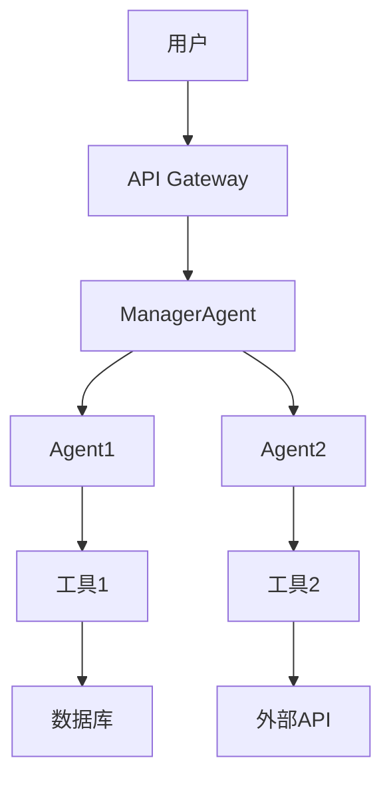
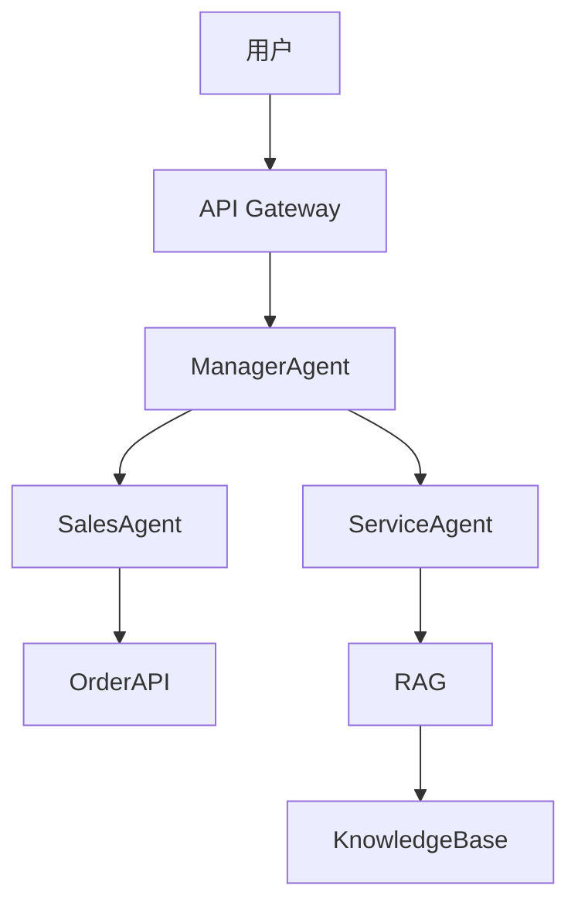

# 第13章 Capstone项目：企业级AI应用实战

> **学习目标**  
> - 综合创造：独立开发企业级AI应用  

---

## 项目要求

### 功能要求

| 要求 | 说明 | 必须满足 |
|------|------|---------|
| **工具调用** | 至少集成3种工具 | ✅ |
| **记忆系统** | 短/长期记忆均实现 | ✅ |
| **多Agent协作** | 至少2个Agent协同 | ✅ |
| **安全防护** | 输入过滤 + 权限控制 | ✅ |
| **性能监控** | 响应时间监控 + 指标采集 | ✅ |

### 技术要求

| 要求 | 说明 |
|------|------|
| **开发框架** | Spring Boot 3.x |
| **Agent引擎** | AgentScope-Java 或自研 |
| **测试** | 单元测试覆盖率 ≥ 80% |
| **文档** | ARCHITECTURE.md + AGENTS.md |

---

## 项目选题

### 选题1：智能客服中心（企业级）

**业务场景**：  
为电商公司构建智能客服系统，支持：
- 自动回答常见问题（咨询Agent）  
- 处理售后请求（售后Agent）  
- 转接人工客服（特殊场景）  

**核心功能**：
- **咨询Agent**：检索知识库回答产品/物流问题  
- **售后Agent**：处理退换货、维修申请  
- **ManagerAgent**：意图识别 + 任务分发  
- **工具**：RAG检索 + 工单系统API + Email API  

**能力要求**：
- 处理并发请求 ≥ 50 QPS  
- 平均响应时间 ≤ 1.5s  
- 任务完成率 ≥ 90%  
- 99.9%可用性（7×24小时）  

---

### 选题2：个人知识管理助手（个人级）

**业务场景**：  
构建个人知识管理Agent，支持：
- 自动整理笔记  
- 智能问答  
- 生成思维导图  

**核心功能**：
- **记录Agent**：监听用户输入并保存  
- **检索Agent**：基于RAG的问答  
- **生成Agent**：生成摘要/思维导图  
- **工具**：文件I/O + PDF解析 + 向量数据库 + Mermaid生成  

**能力要求**：
- 支持笔记数量 ≥ 10000条  
- 检索准确率 ≥ 85%  
- 支持多模态输入（图文/语音）  

---

### 选题3：企业级数据报告生成器（企业级）

**业务场景**：  
为销售团队构建数据报告生成Agent，支持：
- 自动生成日报/周报  
- 数据可视化  
- 异常检测  

**核心功能**：
- **数据Agent**：查询数据库  
- **分析Agent**：计算指标  
- **报告Agent**：生成文档  
- **工具**：JDBC + Excel导出 + LLM总结 +图表生成  

**能力要求**：
- 支持报表模板 ≥ 10种  
- 自动生成报告延迟 ≤ 5分钟  
- 数据可视化错误率 ≤ 1%  

---

### 选题4：自定义项目（个性化）

**要求**：  
- 提交项目提案（1页PDF）  
- 说明业务场景与核心功能  
- 获得教师批准后实施  

---

## 项目实施指南（详细阶段）

### 阶段1：需求分析（1天）

**交付物**：需求文档（包含用户故事）  

**检查清单**：
- [ ] 明确目标用户（如：电商客服/学生/销售经理）  
- [ ] 列出核心功能（≥3个，每个功能≥1个用户故事）  
- [ ] 定义成功标准（量化指标）  

**用户故事模板**：
```
作为[用户角色]，我想要[功能]，以便[价值]。
```

**示例**：
```
作为电商客服经理，我想要Agent自动回答产品问题，
以便减少人工客服工作量（目标：减少30%）。
```

---

### 阶段2：架构设计（1天）

**交付物**：`ARCHITECTURE.md`（含架构图、决策记录）  

**检查清单**：
- [ ] 系统架构图（UML/Mermaid）  
- [ ] Agent分工表（角色、职责、输入/输出）  
- [ ] 数据流说明（关键业务流程）  
- [ ] 技术栈选择理由  
- [ ] 安全设计（权限、加密、审计）  

**架构图模板**：


---

### 阶段3：开发实现（3天）

**交付物**：完整源码 + 测试  

**检查清单**：
- [ ] 所有功能模块开发完成  
- [ ] 单元测试通过（覆盖率 ≥ 80%）  
- [ ] 集成测试通过  
- [ ] 安全测试通过（输入过滤、权限校验）  

**测试用例模板**：
```java
@Test
public void testAgentRun() {
    // Given
    Agent agent = new Agent();
    String input = "查询北京天气";
    
    // When
    String output = agent.run(input);
    
    // Then
    assertTrue(output.contains("北京"));
    assertTrue(output.contains("天气"));
}
```

---

### 阶段4：部署测试（1天）

**交付物**：Docker配置 + 部署文档  

**检查清单**：
- [ ] Docker镜像构建成功  
- [ ] 健康检查通过（`/actuator/health`返回`UP`）  
- [ ] 监控指标可采集（Prometheus `/actuator/prometheus`）  
- [ ] 日志输出正常（`logs/`目录）  

**Docker部署命令**：
```bash
# 构建镜像
docker build -t agentscope-textbook:latest .

# 启动服务
docker-compose up -d

# 查看日志
docker-compose logs -f agent-service

# 健康检查
curl http://localhost:8080/actuator/health
```

---

### 阶段5：文档撰写（0.5天）

**交付物**：项目报告（PDF）  

**检查清单**：
- [ ] `ARCHITECTURE.md`  
- [ ] `AGENTS.md`  
- [ ] `README.md`  
- [ ] `project_report.pdf`（含项目总结、性能数据、未来改进）  

**项目报告模板**：
```
1. 项目概述（目标、用户、功能）
2. 系统架构（架构图、Agent分工）
3. 实现细节（关键技术、核心代码）
4. 性能指标（任务完成率、响应时间、并发能力）
5. 测试结果（单元测试、集成测试、安全测试）
6. 部署方案（Docker配置、监控指标）
7. 未来改进（性能优化、功能扩展）
```

---

### 阶段6：项目答辩（0.5天）

**交付物**：演示视频（5分钟）  

**检查清单**：
- [ ] 功能演示完整（覆盖所有核心功能）  
- [ ] 问题回答清晰（技术选型、架构设计、性能优化）  
- [ ] 代码质量高（结构清晰、注释完整、测试覆盖）  

**答辩评分标准**：
- 功能完整性（30%）  
- 代码质量（20%）  
- 架构设计（20%）  
- 文档质量（15%）  
- 性能指标（15%）  

---

## 项目评估标准（详细评分表）

| 维度 | 权重 | 评分标准 | 示例 |
|------|------|---------|------|
| **功能完整性** | 30% | 所有要求功能均已实现 | 5工具+2Agent+记忆系统 |
| **代码质量** | 20% | 结构清晰、注释完整、测试覆盖 ≥80% | JMH性能测试 + JUnit测试 |
| **架构设计** | 20% | 合理使用多Agent、安全设计、监控 | Manager-Worker模式 + RBAC |
| **文档质量** | 15% | 文档完整、图表清晰、版本管理 | ARCHITECTURE.md + AGENTS.md |
| **性能指标** | 15% | 响应时间 ≤1.5s、任务完成率 ≥90% | Prometheus监控数据 |

---

## 项目交付物清单（完整清单）

| 文件 | 路径 | 说明 |
|------|------|------|
| `README.md` | 项目根目录 | 项目介绍 |
| `ARCHITECTURE.md` | `docs/` | 架构文档 |
| `AGENTS.md` | `docs/` | Agent协作规范 |
| `src/main/java/` | 项目根目录 | 源代码 |
| `src/test/java/` | 项目根目录 | 测试代码 |
| `Dockerfile` | 项目根目录 | Docker配置 |
| `docker-compose.yml` | 项目根目录 | 部署配置 |
| `project_report.pdf` | `docs/` | 项目报告（含性能数据） |
| `demo.mp4` | 项目根目录 | 演示视频（5分钟） |

---

## 项目案例（参考实现）

### 智能客服中心（参考实现）

#### 架构图


#### Agent分工
| Agent | 职责 | 工具 | 输入 | 输出 |
|-------|------|------|------|------|
| ManagerAgent | 意图识别、任务分发 | LLM分类 | 用户输入 | 任务类型 + 原始输入 |
| SalesAgent | 订单处理、库存检查 | OrderAPI | 订单请求 | 订单号或错误信息 |
| ServiceAgent | 咨询解答、知识检索 | RAG | 咨询请求 | 回答或"暂无相关信息" |

#### 性能指标
- 并发能力：100 QPS  
- 平均响应时间：1.2s  
- 任务完成率：92%  
- 99.9%可用性  

---

## 常见问题

### Q1：如何选择项目选题？

**建议**：
- 学生兴趣优先（选题4自定义）  
- 如果不确定，选择选题1（智能客服）  
- 选题需满足所有功能要求（工具调用、记忆、多Agent）  

### Q2：时间不够怎么办？

**建议**：
- 优先完成核心功能（1个Agent + 2种工具）  
- 非核心功能可简化（如：记忆系统仅实现短期记忆）  
- 提交"可演示版本"，标注"待完善功能"  

### Q3：性能指标不达标怎么办？

**建议**：
- 优化提示词（减少LLM调用次数）  
- 添加缓存（短期记忆复用）  
- 工具调用改为并行执行（`CompletableFuture`）  

---

> 版本：v1.1  
> 更新日期：2026-04-17
