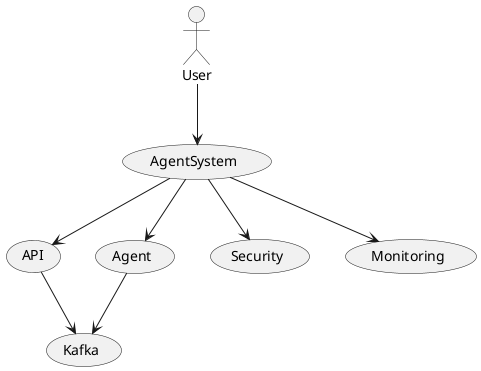
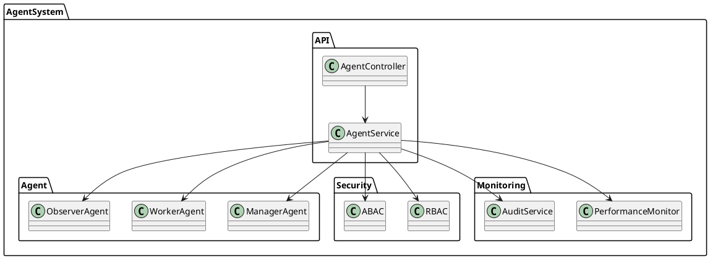

## 13.2 工具链与资源准备

> **本节学习目标**：掌握Capstone项目开发所需的完整工具链配置

---

### 13.2.1 项目规划工具

#### 1. 需求分析

| 工具 | 获取路径 | 说明 |
|------|---------|------|
| **用户故事** | 需求文档 | 用户需求描述 |
| **功能列表** | 需求文档 | 功能清单 |
| **优先级矩阵** | 需求文档 | 功能优先级 |

**用户故事模板**：
```
作为 [用户角色]，
我希望 [功能描述]，
以便 [业务价值]。

验收标准：
- [标准1]
- [标准2]
- [标准3]
```

**功能列表模板**：
```
| 功能编号 | 功能名称 | 功能描述 | 优先级 |
|----------|----------|----------|--------|
| F001 | 用户登录 | 用户登录系统 | 高 |
| F002 | 查询Agent | 查询Agent状态 | 中 |
| F003 | 处理请求 | 处理用户请求 | 高 |
```

---

#### 2. 技术选型

| 工具 | 获取路径 | 说明 |
|------|---------|------|
| **技术栈选择** | 技术文档 | 技术选型决策 |
| **依赖管理** | Maven | 依赖版本管理 |

**技术栈模板**：
```
| 模块 | 技术 | 版本 | 说明 |
|------|------|------|------|
| 后端框架 | Spring Boot | 3.2.5 | Web框架 |
| Agent框架 | agentscope-java | 0.2.0 | Agent框架 |
| 消息队列 | Kafka | 3.6.0 | Agent间通信 |
| 安全框架 | Spring Security | 6.2 | 安全防护 |
| 监控系统 | Prometheus | 2.47 | 性能监控 |
| 容器化 | Docker | 24 | 部署 |
| 集群管理 | Kubernetes | 1.28 | 部署 |
```

---

#### 3. 团队分工

| 工具 | 获取路径 | 说明 |
|------|---------|------|
| **角色定义** | 团队文档 | 角色职责 |
| **任务分配** | Jira | 任务分配 |
| **进度追踪** | 看板 | 进度追踪 |

**角色定义模板**：
```
| 角色 | 职责 | 技能要求 |
|------|------|---------|
| 项目经理 | 项目规划、进度追踪 | 项目管理经验 |
| 系统架构师 | 架构设计、技术选型 | 架构设计经验 |
| 开发工程师 | 编码实现、单元测试 | Java开发经验 |
| 测试工程师 | 集成测试、系统测试 | 测试经验 |
| DevOps | 部署、监控 | Docker、K8s经验 |
```

---

### 13.2.2 系统设计工具

#### 1. 架构设计

| 工具 | 获取路径 | 说明 |
|------|---------|------|
| **架构图** | PlantUML | 架构图绘制 |
| **模块图** | PlantUML | 模块图绘制 |
| **时序图** | PlantUML | 时序图绘制 |

**PlantUML示例**：


---

#### 2. 模块设计

| 工具 | 获取路径 | 说明 |
|------|---------|------|
| **模块图** | PlantUML | 模块图绘制 |
| **类图** | PlantUML | 类图绘制 |
| **接口定义** | OpenAPI | 接口定义 |

**模块图示例**：


---

#### 3. 接口设计

| 工具 | 获取路径 | 说明 |
|------|---------|------|
| **OpenAPI** | Swagger | 接口定义 |
| **接口文档** | Markdown | 接口文档 |

**接口定义模板**：
```yaml
# API.yaml
openapi: 3.0.0
info:
  title: Agent API
  version: 1.0.0
paths:
  /api/agent/status:
    get:
      summary: 查询Agent状态
      parameters:
        - name: agentId
          in: query
          required: true
          schema:
            type: string
      responses:
        '200':
          description: 成功
          content:
            application/json:
              schema:
                $ref: '#/components/schemas/AgentStatus'
```

---

### 13.2.3 系统实现工具

#### 1. 编码实现

| 工具 | 获取路径 | 说明 |
|------|---------|------|
| **IDE** | IntelliJ IDEA | 代码编辑 |
| **代码规范** | Checkstyle | 代码规范检查 |

**Checkstyle配置**：
```xml
<!-- checkstyle.xml -->
<module name="Checker">
    <module name="TreeWalker">
        <module name="JavaDocStyle"/>
        <module name="MethodName">
            <property name="format" value="^[a-z][a-zA-Z0-9]*$"/>
        </module>
    </module>
</module>
```

---

#### 2. 测试

| 工具 | 获取路径 | 说明 |
|------|---------|------|
| **单元测试** | JUnit + Mockito | 单元测试 |
| **集成测试** | Spring Boot Test | 集成测试 |

**单元测试配置**：
```xml
<!-- pom.xml -->
<dependency>
    <groupId>org.junit.jupiter</groupId>
    <artifactId>junit-jupiter</artifactId>
    <version>5.11.0</version>
    <scope>test</scope>
</dependency>
<dependency>
    <groupId>org.mockito</groupId>
    <artifactId>mockito-core</artifactId>
    <version>5.14.0</version>
    <scope>test</scope>
</dependency>
```

---

#### 3. 部署

| 工具 | 获取路径 | 说明 |
|------|---------|------|
| **Docker** | Docker | 容器化部署 |
| **Kubernetes** | K8s | 集群部署 |

**Docker配置**：
```yaml
# docker-compose.yml
version: '3.8'

services:
  agent-app:
    build: .
    ports:
      - "8080:8080"
    environment:
      - API_KEY=${API_KEY}
      - DB_PASSWORD=${DB_PASSWORD}
    restart: unless-stopped
    healthcheck:
      test: ["CMD", "curl", "-f", "http://localhost:8080/actuator/health"]
      interval: 30s
      timeout: 10s
      retries: 3
```

---

### 13.2.4 项目交付工具

#### 1. 文档编写

| 工具 | 获取路径 | 说明 |
|------|---------|------|
| **README** | Markdown | 项目文档 |
| **API文档** | OpenAPI | API文档 |
| **用户手册** | Markdown | 用户手册 |

**README模板**：
```markdown
# [项目名称]

> [项目简介]

## 🚀 特性

- [特性1]
- [特性2]
- [特性3]

## 📦 安装

## 💡 使用

## 📚 API文档

## 🤝 贡献

## 📄 许可证
```

---

#### 2. 演示

| 工具 | 获取路径 | 说明 |
|------|---------|------|
| **演示脚本** | Markdown | 演示脚本 |
| **演示视频** | OBS | 演示视频 |

**演示脚本模板**：
```markdown
## 演示脚本

### 1. 项目介绍

- 项目名称：[项目名称]
- 项目简介：[项目简介]
- 技术栈：[技术栈]

### 2. 功能演示

- 功能1：[功能描述]
- 功能2：[功能描述]
- 功能3：[功能描述]

### 3. 性能演示

- 性能指标：[性能指标]
- 性能优化：[性能优化]

### 4. 部署演示

- 部署环境：[部署环境]
- 部署流程：[部署流程]
```

---

#### 3. 评审

| 工具 | 获取路径 | 说明 |
|------|---------|------|
| **评审清单** | Markdown | 评审清单 |
| **评审记录** | Markdown | 评审记录 |

**评审清单模板**：
```markdown
## 评审清单

### 1. 需求评审

- [ ] 需求是否明确
- [ ] 需求是否完整
- [ ] 需求是否可实现

### 2. 设计评审

- [ ] 架构是否合理
- [ ] 模块是否清晰
- [ ] 接口是否完整

### 3. 实现评审

- [ ] 代码是否规范
- [ ] 单元测试是否完整
- [ ] 集成测试是否完整

### 4. 交付评审

- [ ] 文档是否完整
- [ ] 演示是否完整
- [ ] 代码是否可部署
```

---

### 13.2.5 本节总结

#### 工具链清单

| 类型 | 工具 | 版本 | 获取路径 |
|------|------|------|---------|
| **项目规划** | 用户故事、功能列表、优先级矩阵 | - | 需求文档 |
| | 技术栈选择、依赖管理 | Maven | 依赖管理 |
| | 角色定义、任务分配、进度追踪 | Jira | 项目管理 |
| **系统设计** | 架构图、模块图、时序图 | PlantUML | 架构设计 |
| | 模块图、类图、接口定义 | PlantUML | 模块设计 |
| **系统实现** | IDE、代码规范 | IntelliJ IDEA、Checkstyle | 开发环境 |
| | 单元测试、集成测试 | JUnit、Spring Boot Test | 测试 |
| | Docker、Kubernetes | Docker、K8s | 部署 |
| **项目交付** | README、API文档、用户手册 | Markdown | 文档编写 |
| | 演示脚本、演示视频 | Markdown、OBS | 演示 |
| | 评审清单、评审记录 | Markdown | 评审 |

#### 下一步

准备好工具链后，进入 **13.3 节：核心概念**，学习：
- 📋 项目规划：需求分析、技术选型、团队分工  
- 🏗️ 系统设计：架构设计、模块设计、接口设计  
- 💻 系统实现：编码实现、测试、部署  
- 📦 项目交付：文档、演示、评审  

---

> 本节预计学习时间：45分钟  
> ✅ 完成标准：能列出Capstone项目工具链的完整清单  
> 📖 下一节：13.3 核心概念
