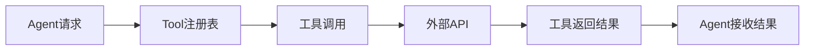
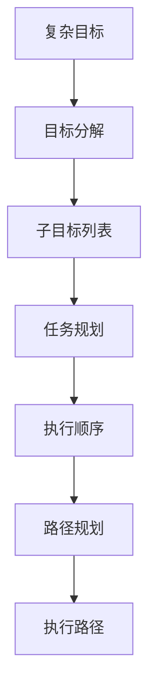
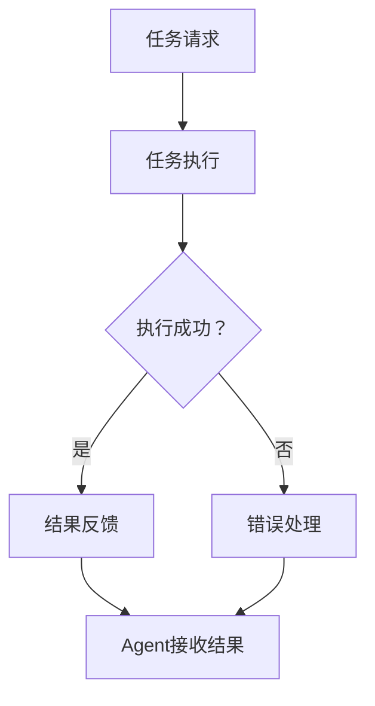

# 4.3 核心概念

> **本节学习目标**：掌握Agent架构开发的核心原理

---

## 4.3.1 Agent核心架构

### 4.3.1.1 Agent架构定义

**Agent架构** 是AI Agent的核心结构，定义Agent的组织方式与运行机制。

```
Agent架构 = 核心组件 + 运行机制 + 协作模式
```

**Agent架构核心特性**：
| 特性 | 说明 |
|------|------|
| **核心组件** | Memory、Tool、Planning、Execution |
| **运行机制** | 感知、推理、决策、行动 |
| **协作模式** | 单Agent、多Agent协作 |

### 4.3.1.2 核心组件

| 组件 | 说明 |
|------|------|
| **Memory** | 记忆系统，存储历史信息 |
| **Tool** | 工具系统，调用外部API |
| **Planning** | 计划系统，制定行动方案 |
| **Execution** | 执行系统，执行具体操作 |

### 4.3.1.3 运行机制

```
感知环境 → 推理决策 → 执行行动 → 反馈学习
```

### 4.3.1.4 协作模式

| 模式 | 说明 |
|------|------|
| **单Agent** | 单个Agent独立工作 |
| **多Agent** | 多个Agent协作工作 |

---

## 4.3.2 Memory系统

### 4.3.2.1 Memory系统定义

**Memory系统** 是Agent的记忆系统，存储历史信息。

```
Memory系统 = 短期记忆 + 长期记忆 + 上下文记忆
```

**Memory系统核心特性**：
| 特性 | 说明 |
|------|------|
| **短期记忆** | 存储当前对话历史 |
| **长期记忆** | 存储长期知识库 |
| **上下文记忆** | 存储任务上下文 |

### 4.3.2.2 Memory系统实现

| 实现 | 说明 |
|------|------|
| **短期记忆** | 使用内存存储 |
| **长期记忆** | 使用数据库存储 |
| **上下文记忆** | 使用上下文窗口存储 |

---

## 4.3.3 Tool系统

### 4.3.3.1 Tool系统定义

**Tool系统** 是Agent的工具系统，调用外部API。

```
Tool系统 = 工具注册 + 工具调用 + 工具反馈
```

**Tool系统核心特性**：
| 特性 | 说明 |
|------|------|
| **工具注册** | 注册外部工具 |
| **工具调用** | 调用外部工具 |
| **工具反馈** | 获取工具执行结果 |

### 4.3.3.2 Tool系统实现

| 实现 | 说明 |
|------|------|
| **工具注册** | 使用工具注册表 |
| **工具调用** | 使用API调用工具 |
| **工具反馈** | 使用回调函数获取结果 |

### 4.3.3.3 Tool系统数据流图



---

## 4.3.4 Planning系统

### 4.3.4.1 Planning系统定义

**Planning系统** 是Agent的计划系统，制定行动方案。

```
Planning系统 = 目标分解 → 任务规划 → 路径规划
```

**Planning系统核心特性**：
| 特性 | 说明 |
|------|------|
| **目标分解** | 分解复杂目标为子目标 |
| **任务规划** | 规划任务执行顺序 |
| **路径规划** | 规划任务执行路径 |

### 4.3.4.2 Planning系统实现

| 实现 | 说明 |
|------|------|
| **目标分解** | 使用目标分解算法 |
| **任务规划** | 使用任务规划算法 |
| **路径规划** | 使用路径规划算法 |

### 4.3.4.2 Planning系统数据流图



---

## 4.3.5 Execution系统

### 4.3.5.1 Execution系统定义

**Execution系统** 是Agent的执行系统，执行具体操作。

```
Execution系统 = 任务执行 → 结果反馈 → 错误处理
```

**Execution系统核心特性**：
| 特性 | 说明 |
|------|------|
| **任务执行** | 执行具体任务 |
| **结果反馈** | 反馈任务执行结果 |
| **错误处理** | 处理任务执行错误 |

### 4.3.5.2 Execution系统实现

| 实现 | 说明 |
|------|------|
| **任务执行** | 使用任务执行引擎 |
| **结果反馈** | 使用回调函数反馈结果 |
| **错误处理** | 使用异常处理机制 |

### 4.3.5.2 Execution系统数据流图



---

## 4.3.6 本节总结

| 核心概念 | 实现要点 |
|---------|---------|
| **Agent架构** | 核心组件、运行机制、协作模式 |
| **Memory系统** | 短期记忆、长期记忆、上下文记忆 |
| **Tool系统** | 工具注册、工具调用、工具反馈 |
| **Planning系统** | 目标分解、任务规划、路径规划 |
| **Execution系统** | 任务执行、结果反馈、错误处理 |

---

## 4.3.7 本节思考题

**问题1**：什么是Agent架构？  
**提示**：思考Agent的核心组件、运行机制、协作模式  

**问题2**：什么是Memory系统？  
**提示**：思考Memory系统的短期记忆、长期记忆、上下文记忆  

**问题3**：什么是Tool系统？  
**提示**：思考Tool系统的工具注册、工具调用、工具反馈  

**问题4**：什么是Planning系统？  
**提示**：思考Planning系统的goal分解、任务规划、路径规划  

**问题5**：什么是Execution系统？  
**提示**：思考Execution系统的任务执行、结果反馈、错误处理  

---

## 4.3.8 下节预告

下一节将实现**最小可运行示例**，包括：
- 🏗️ Agent架构最小可运行示例  
- 🧠 Memory系统最小可运行示例  
- 🔧 Tool系统最小可运行示例  
- 📋 Planning系统最小可运行示例  
- ⚙️ Execution系统最小可运行示例  

---

> 本节预计学习时间：30分钟  
> ✅ 完成标准：能解释Agent架构核心概念与原理  
> 📖 下一节：4.4 最小可运行示例
