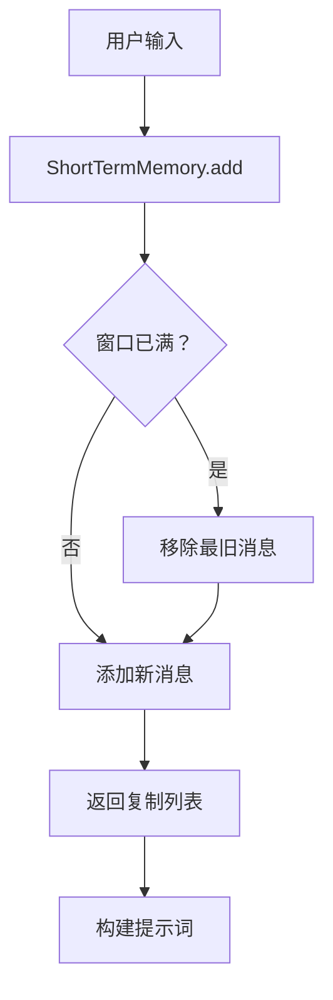
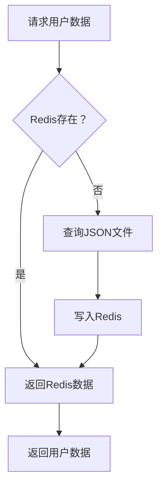
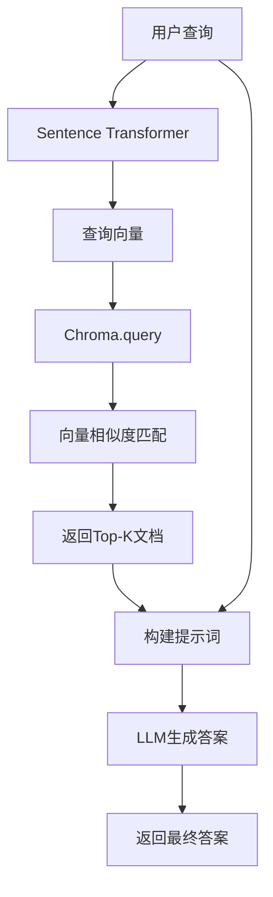
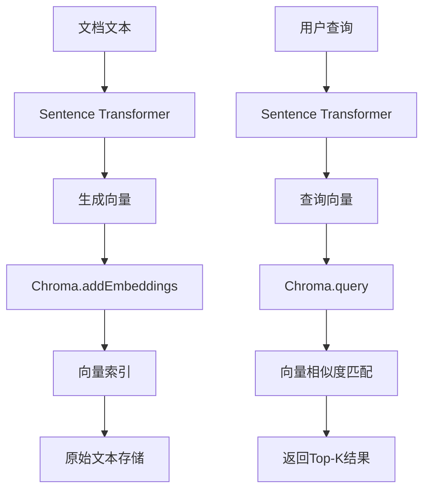
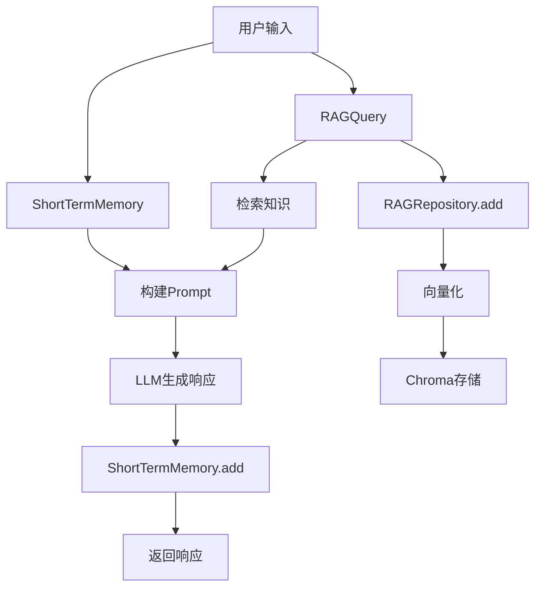

# 5.3 核心概念

> **本节学习目标**：掌握短期记忆、长期记忆与RAG的核心原理与数据结构设计

---

## 5.3.1 短期记忆（Short-Term Memory）

### 5.3.1.1 概念定义

**短期记忆**：Agent在当前对话窗口内保留的历史消息，用于维持上下文连贯性。

**设计目标**：
- ✅ 支持至少10轮对话
- ✅ 固定窗口大小（如：20条消息）
- ✅ 自动截断旧消息防止上下文溢出

### 5.3.1.2 数据结构设计

**链式队列（LinkedList）**：
```
┌─────────────┐
│ User: 北京天气？ │ ← head（最新）
├─────────────┤
│ Agent: 晴，15-25℃ │
├─────────────┤
│ User: 后天呢？     │
├─────────────┤
│ Agent: 阴转雨，12-20℃ │
├─────────────┤
│ User: 需要带伞吗？ │
└─────────────┘
        ↑
    tail（最旧）
```

**固定窗口策略数据流图**：



**固定窗口策略**：
```java
public class ShortTermMemory {
    private final LinkedList<Message> history = new LinkedList<>();
    private final int maxMessages = 20; // 固定窗口大小

    public void add(Message msg) {
        history.addLast(msg);
        if (history.size() > maxMessages) {
            history.removeFirst(); // 移除最旧消息
        }
    }

    public List<Message> getRecent() {
        return new ArrayList<>(history); // 返回复制列表
    }
}
```

### 5.3.1.3 上下文溢出问题

**问题**：即使固定窗口，总token数仍可能超出模型限制。

**示例计算**：
```
每条消息平均长度：200 tokens
窗口大小：20条
总token数：20 × 200 = 4000 tokens

GPT-4上下文限制：128K tokens（≈95,000汉字）
```

**结论**：固定窗口对短对话足够，但**长对话仍需压缩策略**。

### 5.3.1.4 压缩策略（扩展）

**摘要压缩**：
```
原始消息：
- User: 北京天气？
- Agent: 晴，15-20℃，微风3级，紫外线弱

压缩后：
- [摘要] 北京明天晴，气温15-20℃
```

**实现思路**：
```java
public class CompressedMemory {
    private final LLMService llmService;
    
    public CompressedMemory(LLMService llmService) {
        this.llmService = llmService;
    }
    
    public String compress(List<Message> messages) {
        // 使用LLM生成摘要
        String prompt = "将以下对话压缩为3句话摘要：\n" + 
                       messages.stream()
                               .map(m -> m.role + ": " + m.content)
                               .collect(Collectors.joining("\n"));
        return llmService.generate(prompt);
    }
}
```

---

## 5.3.2 长期记忆（Long-Term Memory）

### 5.3.2.1 概念定义

**长期记忆**：Agent跨对话保存的用户偏好、历史记录与私有知识。

**设计目标**：
- ✅ 跨会话持久化（Redis/JSON文件）
- ✅ 快速检索（HashMap索引）
- ✅ 支持更新与删除

### 5.3.2.2 数据结构设计

**JSON持久化结构**：
```json
{
  "user_id": "u123456",
  "preferences": {
    "name": "张三",
    "role": "学生",
    "learning_style": "视觉型"
  },
  "history": [
    {
      "timestamp": "2025-04-17T10:30:00Z",
      "session_id": "s789",
      "summary": "询问复习计划，提供模板"
    }
  ]
}
```

**Java类定义**：
```java
public class LongTermMemory {
    private String userId;
    private Map<String, Object> preferences;
    private List<SessionRecord> history;

    // JSON序列化
    public String toJson() {
        return objectMapper.writeValueAsString(this);
    }

    // JSON反序列化
    public static LongTermMemory fromJson(String json) {
        return objectMapper.readValue(json, LongTermMemory.class);
    }
}
```

### 5.3.2.3 缓存策略（Redis）

**问题**：文件IO性能低，频繁读写影响响应速度。

**解决方案**：Redis缓存 + 文件持久化双层架构。
```
┌──────────────────┐
│  应用层           │
└────────┬─────────┘
         │
    ┌────┴────┐
    │  读取/写入 │
    └────┬────┘
         │
┌────────▼────────┐
│  Redis缓存       │ ← 快速访问（毫秒级）
│  user:u123456  │
└─────────────────┘
         │
    ┌────┴────┐
    │  定时同步 │
    └────┬────┘
         │
┌────────▼────────┐
│  JSON文件存储    │ ← 持久化（断电不丢失）
│  user-u123456.json │
└─────────────────┘
```

**Redis操作数据流图**：



**Redis操作示例**：
```java
public class LongTermMemoryCache {
    private final RedisTemplate<String, String> redisTemplate;

    public LongTermMemory get(String userId) {
        String json = redisTemplate.opsForValue().get("user:" + userId);
        return LongTermMemory.fromJson(json);
    }

    public void save(String userId, LongTermMemory memory) {
        String json = memory.toJson();
        redisTemplate.opsForValue().set("user:" + userId, json);
    }
}
```

---

## 5.3.3 RAG（Retrieval-Augmented Generation）

### 5.3.3.1 概念定义

**RAG**：在生成响应前，先从私有知识库检索相关信息，再喂给LLM生成答案。

**对比传统方案**：
| 方案 | 数据来源 | 更新频率 | 适用场景 |
|------|---------|---------|---------|
| **硬编码知识** | 训练数据截止日期 | 每月/每年 | 通用知识 |
| **RAG** | 用户私有知识库 | 实时 | 专业领域/内部文档 |

### 5.3.3.2 技术原理

**步骤1：知识入库（Embedding）**
```
原始文档：
"Spring Boot是Spring的快速开发框架，简化了XML配置"

↓ 向量化（Sentence Transformer）
向量：[0.12, -0.34, 0.56, ..., 0.08]（384维）
```

**步骤2：用户提问**
```
用户："Spring Boot有什么优势？"
↓ 向量化
向量：[0.15, -0.30, 0.60, ..., 0.10]
```

**RAG完整数据流图**：



**步骤3：相似度检索（余弦相似度）**
```
检索到3个最相似的向量：
1. "Spring Boot简化了XML配置" → 相似度 0.92
2. "Spring Boot自动配置Bean" → 相似度 0.87
3. "Spring Boot内嵌Tomcat" → 相似度 0.85
```

**步骤4：生成答案**
```
LLM输入：
"根据以下参考资料回答用户问题：

[参考1] Spring Boot简化了XML配置
[参考2] Spring Boot自动配置Bean
[参考3] Spring Boot内嵌Tomcat

问题：Spring Boot有什么优势？

答案："
↓
LLM输出：
"Spring Boot的主要优势包括：
1. 简化XML配置（自动装配Bean）
2. 内嵌Tomcat（无需部署WAR包）
3. 快速开发（约定优于配置）"
```

### 5.3.3.3 向量数据库（Vector Database）

**为什么需要向量数据库？**

| 数据库 | 查询方式 | 适用场景 |
|--------|---------|---------|
| **MySQL** | WHERE name = '张三' | 精确匹配 |
| **Chroma** | 近似最近邻（ANN） | 语义相似度 |

**Chroma架构示意图**：
```
┌──────────────────────┐
│  应用层（Java）       │
└──────────┬───────────┘
           │ HTTP/gRPC
┌──────────▼───────────┐
│  Chroma Server       │
│  - REST API          │
│  - GRPC Endpoint     │
└──────────┬───────────┘
           │
┌──────────▼───────────┐
│  存储层              │
│  - 内存（向量索引）   │
│  -磁盘（原始文本）    │
└──────────────────────┘
```

**Chroma数据流图**：



**Chroma Java Client示例**：
```java
public class RAGRepository {
    private final ChromaClient client;

    public void addDocument(String text) {
        Embedding embedding = sentenceTransformer.encode(text);
        client.addEmbeddings("documents", Arrays.asList(text), 
                            Arrays.asList(embedding));
    }

    public List<String> retrieve(String query, int k = 3) {
        Embedding queryEmbedding = sentenceTransformer.encode(query);
        QueryResult result = client.query("documents", 
                                         Arrays.asList(queryEmbedding), k);
        return result.getDocuments(); // 返回最相似的3个文本
    }
}
```

---

## 5.3.4 三者关系对比

| 维度 | 短期记忆 | 长期记忆 | RAG |
|------|---------|---------|-----|
| **数据范围** | 当前对话（20条） | 用户偏好（JSON） | 私有知识库（PDF/HTML） |
| **生命周期** | 消息溢出即丢弃 | 永久保存（除非删除） | 按需更新（新文档入库） |
| **检索方式** | 顺序遍历 | HashMap索引 | 向量相似度匹配 |
| **性能要求** | O(1)添加/删除 | O(1)读取/写入 | O(log N)检索（ANN） |
| **技术栈** | LinkedList | Redis + JSON | Chroma + SentenceTransformer |

### 5.3.4.1 记忆系统数据流图



---

## 5.3.5 常见误区

### 5.3.5.1 误区1：RAG = 全文检索

**错误**：认为RAG就是简单的关键词搜索（如grep）。

**正确**：RAG使用**语义相似度**，而非关键词匹配。

**示例**：
```
文档："Spring Boot简化了XML配置"
查询："Spring Boot的配置方式"

- 全文检索：不匹配（"简化" vs "配置"，"XML" vs "方式"）
- RAG：高相似度（语义相关：配置简化）
```

### 5.3.5.2 误区2：记忆越多越好

**错误**：认为短期记忆的窗口越大越好。

**正确**：窗口越大 → token消耗越高 → API成本增加 → 模型注意力分散。

**建议**：根据应用场景调整窗口大小。

| 应用类型 | 推荐窗口大小 | 原因 |
|---------|------------|------|
| 聊天机器人 | 10-20条 | 对话简短，上下文窗口小 |
| 客服系统 | 30-50条 | 多轮追问，需更多历史 |
| 代码助手 | 5-10条 | 精准定位，冗余信息干扰 |

---

## 5.3.6 本节思考题

**问题1**：为什么短期记忆不能直接用HashMap？  
**提示**：思考顺序依赖（对话轮次）与先进先出（FIFO）需求  

**问题2**：RAG与本地知识库（如文件夹）的区别是什么？  
**提示**：思考向量检索 vs 文件遍历的性能差异  

**问题3**：如果用户每天访问10次，如何设计长期记忆的更新策略？  
**提示**：考虑合并小更新、延迟写入、批量持久化  

---

## 5.3.7 下节预告

下一节将提供**最小可运行示例**，包括：
- 短期记忆的LinkedList实现
- 长期记忆的Redis + JSON存储
- RAG的Chroma + SentenceTransformer集成

---

> 本节预计学习时间：30分钟  
> ✅ 完成标准：能绘制短期/长期记忆与RAG的数据流图  
> 📖 下一节：5.4 最小可运行示例
