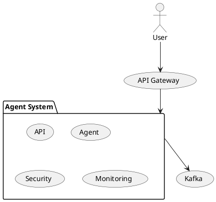

# 13.6 课后练习

> **本节学习目标**：通过实践巩固本章知识，掌握项目开发流程

---

## 13.6.1 基础填空（20分）

**说明**：每题2分，共10题，满分20分

1. Capstone项目开发的四个阶段是：______、______、______、______  
2. 需求分析的三个步骤是：______、______、______  
3. 技术选型的四个原则是：______、______、______、______  
4. 团队角色包括：______、______、______、______、______  
5. 系统设计包括：______、______、______  
6. 架构图绘制工具是：______  
7. 接口定义工具是：______  
8. 单元测试框架是：______  
9. 集成测试框架是：______  
10. 部署工具是：______、______

**答案**：
1. 项目规划、系统设计、系统实现、项目交付  
2. 需求收集、需求分析、需求文档  
3. 成熟稳定、社区活跃、性能优秀、易于维护  
4. 项目经理、系统架构师、开发工程师、测试工程师、DevOps  
5. 架构设计、模块设计、接口设计  
6. PlantUML  
7. OpenAPI/Swagger  
8. JUnit + Mockito  
9. Spring Boot Test  
10. Docker、Kubernetes

---

## 13.6.2 代码改错（30分）

**说明**：每题15分，共2题，满分30分

### 题目1：需求文档缺失（15分）

**问题**：以下是某项目的需求文档，请找出其中的5个问题并修改：

```markdown
# 需求文档

# 1. 项目背景
项目名称：Agent系统
项目目标：实现一个Agent系统
项目范围：开发

# 2. 用户需求
用户角色：管理员、用户
用户故事：
- 管理员登录
- 用户查询Agent

# 3. 功能需求
功能列表：
- 功能1：管理员登录
- 功能2：用户查询Agent

# 4. 验收标准
- 需求文档完整
- 系统实现完整
```

**改错要求**：
1. 找出5个问题  
2. 修改问题，完善需求文档  
3. 每个问题修改得当得3分，满分15分

**参考答案**：
```
问题1：用户故事缺少验收标准  
修改：补充用户故事的验收标准

问题2：功能需求缺少优先级  
修改：添加功能优先级

问题3：缺少非功能需求  
修改：添加性能需求、安全需求、可用性需求

问题4：缺少技术需求  
修改：添加技术栈

问题5：缺少项目约束  
修改：添加时间约束、成本约束、资源约束
```

---

### 题目2：接口定义缺失（15分）

**问题**：以下是某项目的接口定义，请找出其中的3个问题并修改：

```java
/**
 * Agent服务接口
 */
public interface AgentService {
    String process(String query);
}
```

**改错要求**：
1. 找出3个问题  
2. 修改问题，完善接口定义  
3. 每个问题修改得当得5分，满分15分

**参考答案**：
```
问题1：缺少方法注释  
修改：添加方法功能说明

问题2：缺少参数注释  
修改：添加参数说明

问题3：缺少返回值注释  
修改：添加返回值说明

问题4：缺少异常说明  
修改：添加异常说明
```

---

## 13.6.3 小型设计（30分）

**说明**：每题15分，共2题，满分30分

### 题目1：用户故事设计（15分）

**任务**：为“查询Agent状态”功能设计用户故事，要求：

1. 用户角色：用户  
2. 功能描述：查询Agent状态  
3. 验收标准：≥3条  

**评分标准**：
- 用户角色明确（3分）  
- 功能描述清晰（3分）  
- 验收标准完整（9分）  

**参考答案**：
```markdown
用户故事：查询Agent状态

作为 用户，
我希望 查询Agent状态，
以便 了解Agent的运行状态。

验收标准：
1. 用户可以通过Agent ID查询Agent状态
2. 查询成功时，返回Agent状态
3. 查询失败时，显示错误信息
```

---

### 题目2：架构图设计（15分）

**任务**：设计“Agent Capstone项目”架构图，要求：

1. 包含用户、API Gateway、Agent System、Kafka  
2. 模块职责清晰  
3. 时序关系明确  

**评分标准**：
- 架构图完整（5分）  
- 模块职责清晰（5分）  
- 时序关系明确（5分）  

**参考答案**：


---

## 13.6.4 拓展挑战（20分）

**说明**：每题10分，共2题，满分20分

### 题目1：需求变更处理（10分）

**任务**：某项目在开发中期，客户提出新需求，要求：

1. 需求变更评估  
2. 变更流程设计  
3. 影响分析  

**评分标准**：
- 需求变更评估合理（3分）  
- 变更流程完整（4分）  
- 影响分析全面（3分）  

**参考答案**：
```
1. 需求变更评估：
- 影响范围：新增功能
- 工作量评估：+5人日
- 风险评估：中

2. 变更流程：
- 客户提出变更需求
- 变更影响分析
- 变更评审
- 变更批准
- 需求文档更新
- 项目计划更新

3. 影响分析：
- 时间影响：+5天
- 成本影响：+¥1万
- 资源影响：+1人
```

---

### 题目2：CI/CD流程设计（10分）

**任务**：设计“Agent Capstone项目”的CI/CD流程，要求：

1. CI流程：构建、测试、检查  
2. CD流程：构建Docker镜像、部署到K8s  
3. 触发条件明确  

**评分标准**：
- CI流程完整（4分）  
- CD流程完整（4分）  
- 触发条件明确（2分）  

**参考答案**：
```
CI流程：
1. 触发条件：Push到main分支、Pull Request
2. 构建：mvn clean package
3. 测试：mvn test
4. 检查：Checkstyle、SpotBugs

CD流程：
1. 触发条件：Push到main分支
2. 构建Docker镜像：docker build -t agent-capstone:latest .
3. 推送Docker镜像：docker push agent-capstone:latest
4. 部署到K8s：kubectl apply -f k8s/
```

---

## 13.6.5 自测表

| 知识点 | 掌握程度（1-5分） | 自测问题 |
|--------|----------------|---------|
| 需求分析 | □1 □2 □3 □4 □5 | 如何编写需求文档？ |
| 系统设计 | □1 □2 □3 □4 □5 | 如何设计系统架构？ |
| 系统实现 | □1 □2 □3 □4 □5 | 如何编写单元测试？ |
| 项目交付 | □1 □2 □3 □4 □5 | 如何编写README？ |

**建议**：
- ≥4分：恭喜你！可以进入下一章学习  
- ≤3分：建议重读本章并完成课后练习

---

## 13.6.6 本节总结

| 练习类型 | 题目 | 分值 | 目标 |
|---------|------|------|------|
| 基础填空 | 10题 | 20分 | 概念记忆 |
| 代码改错 | 2题 | 30分 | 问题排查 |
| 小型设计 | 2题 | 30分 | 系统设计 |
| 拓展挑战 | 2题 | 20分 | 综合能力 |

**总分**：100分  
**及格线**：60分

---

> 本节预计学习时间：1小时  
> ✅ 完成标准：总分≥60分  
> 📖 下一节：13.7 本章小结与延伸阅读
